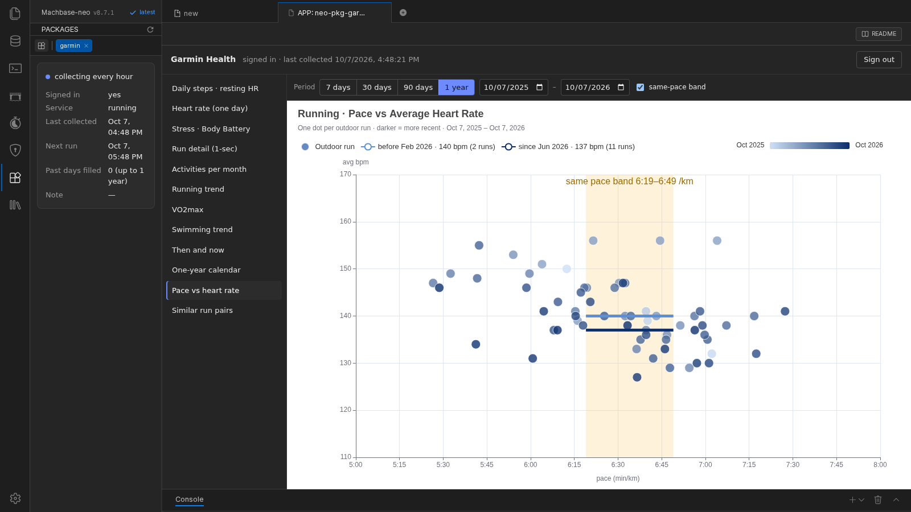

# Garmin Health (neo-pkg-garmin)

[English](README.md) | [한국어](README.ko.md) | [日本語](README.ja.md)

**ご自身の Garmin Connect のデータ(心拍、ストレス、Body Battery、歩数、睡眠、1 秒間隔のワークアウト記録)を Machbase に集め**、ダッシュボードで表示する machbase-neo パッケージです。

- アプリで一度サインインするだけです。その後は 1 時間ごとにバックグラウンドで収集し、サインイン直後には最大 1 年前までの過去データを取り込みます。
- **12 個の TQL ダッシュボード** — 1 日の心拍から 1 年カレンダー、ランニングの推移、「同じペースで心拍が下がった」比較まで。
- すべて通常の Machbase テーブルに保存されるため、SQL・TQL で照会したり、AI チャットパッケージ(`neo-pkg-llm-chat`)に質問したりできます。

> **非公式パッケージです。** Garmin とは提携・保証・サポートの関係がありません。Garmin Connect モバイルアプリと同じサインイン・データのインターフェースを使用しており、Garmin はこれを公開 API として提供していません。ご自身のアカウントでのみ、自己責任でご利用ください — [免責事項](#免責事項)を参照してください。



## 動作要件

- machbase-neo 8.7.1 以上
- ご自身の Garmin Connect アカウント(メールアドレスとパスワード)。2 段階認証のアカウントも使えます — Garmin から届いたコードを入力します。
- サーバーから HTTPS で `sso.garmin.com`、`connectapi.garmin.com`、`thegarth.s3.amazonaws.com` に接続できる必要があります(最後のアドレスから、Garmin Connect モバイルクライアントが使う公開クライアントキーを読み込みます)。
- machbase-neo サーバーの OS は **Garmin アカウントと同じタイムゾーン**にしてください。日付はサーバーのタイムゾーンで数え、チャートの時刻はブラウザーのタイムゾーンで表示されます。
- ディスク使用量はわずかです — 時計 1 台で 1 年あたり約 150 万件。

## インストール

1. このリポジトリの **Code → Download ZIP** で ZIP をダウンロードするか、**Releases** からアーカイブをダウンロードします。
2. ダウンロードしたファイルを**展開せずに**、machbase-neo のインストールディレクトリの `public/` に置きます。

   ```text
   <machbase-neo インストールディレクトリ>/
   ├── machbase-neo
   └── public/
       └── neo-pkg-garmin-main.zip   ← ここに置きます
   ```

3. machbase-neo の Web UI で **App Store** を開き、一覧を更新して `neo-pkg-garmin` の **Install** をクリックします。
4. インストールが終わると収集サービスがすぐに起動し、サインインを待ちます。サイドパネルの **Start / Stop**(または App Store カードのスイッチ)でオン・オフを切り替えます。

App Store は **machbase-neo を起動したディレクトリ**の `public/` からアーカイブを探します。`--file` で別のディレクトリを指定して起動した場合は[トラブルシューティング](#トラブルシューティング)を参照してください。

### 更新

新しいアーカイブを `public/` に置き、App Store で **Update** をクリックします。サインイン状態と収集したデータはそのまま残ります。
`public/` にパッケージ名とバージョンが同じアーカイブが 2 つあるとインストールに失敗するため、古いファイルは削除してください。

### アンインストール

Garmin のトークンも削除したい場合は、先にアプリで **Sign out** をクリックします。次に App Store で **Uninstall** をクリックすると、収集サービスが停止し登録が削除されます。
**収集したデータは `GARMIN` データベースに残ります。** 不要であれば SQL で削除します。

```sql
DROP TABLE GARMIN.SYS.METRIC CASCADE;
DROP TABLE GARMIN.SYS.SPAN;
DROP TABLE GARMIN.SYS.SYNC_LOG;
DROP DATABASE GARMIN;
```

## 使い方

**App Store** で `neo-pkg-garmin` をクリックするとパッケージタブが開きます。サイドパネルに収集状態が表示されます。

### サインイン

- Garmin のメールアドレスとパスワードを入力し、Garmin に求められた場合は届いた認証コードを入力します(5 分以内に入力)。
- **パスワードは保存しません。** HTTPS で Garmin のサインインサーバーにだけ送信します。残るのは Garmin が返すトークンだけで、所有者のみが読めるパーミッションのファイルに保存します(Linux・macOS)。
- トークンがあれば、再度サインインしなくても収集は続きます — アクセス権は自動的に更新されます。再サインインが必要なのは、**Sign out** したとき、Garmin のパスワードを変更したとき、Garmin がトークンを無効にしたときだけです。
- アカウント保護のため、サインインに 3 回失敗すると 15 分間、Garmin がサインインを制限すると(HTTP 429)2 時間、サインインを受け付けません。サインインを繰り返すと Garmin にアカウントを制限されることがあります。
- machbase-neo サーバー 1 台につき Garmin のサインインは **1 つ**です。そのサーバーを使う全員が同じデータを見ます。

### 収集(自動 — ボタン操作は不要)

- **1 時間ごと**:昨日と今日。時計の同期が遅れても取りこぼさないよう昨日も読み直し、保存済みの記録はスキップします。
- **サインイン直後**:過去の日を 15 秒に 1 日ずつ、最大 1 年前まで取り込みます(1 年分で約 2 時間)。
- Garmin がリクエストを制限すると(HTTP 429)、1 時間休止してから再開します。
- 新しいデータは、時計が Garmin Connect(スマートフォンアプリ)と同期した後に入ります。
- Garmin が返す過去の範囲:歩数とワークアウトは 1 年以上、2〜3 分間隔の心拍・ストレス・Body Battery は直近約 5 か月です。

### ダッシュボード

左の一覧からダッシュボードを選びます。上部のバーで期間を指定します — **7 days · 30 days · 90 days · 1 year** または日付の範囲。

| ダッシュボード | 表示内容 |
|---|---|
| Daily steps · resting HR | 1 日の歩数(棒)と安静時心拍(線) |
| Heart rate (one day) | 1 日の心拍、10 分平均。日付を選びます |
| Stress · Body Battery | 1 日のストレスと Body Battery |
| Run detail (1-sec) | 1 回のランニングの 1 秒間隔の心拍。選んだ日付以前の最後のランニング、下のスライダーで拡大 |
| Activities per month | 種目別(スイム・ラン・その他)の月別ワークアウト数 |
| Running trend | 月平均ペース(移動時間ベース)と心拍 |
| VO2max | ランニングごとに Garmin が推定した VO2max |
| Swimming trend | 月平均の 100 m ペースと心拍 |
| Then and now | 2 回のランニングの心拍を移動時間で重ねて表示。前の日付以降の最初のランニングと、後の日付以前の最後のランニング |
| One-year calendar | 1 マスが 1 日(グレー = 歩数)、点はワークアウト。1 列が 1 週間で、上から下へ月〜日 |
| Pace vs heart rate | 屋外ランニング 1 回が点 1 つ。「同じペースの帯」で前の期間と後の期間の平均心拍を比較(チェックボックスで非表示) |
| Similar run pairs | 距離 ±10%・ペース ±10 秒/km 以内の、前のランニングと後のランニングの組。矢印は前のランニングから後のランニングへ |

### サイドパネル

収集状態(サインイン待ち・過去データ取り込み中・1 時間ごとに収集・Garmin の制限で休止・停止)、サインインの有無、サービスの状態、前回と次回の収集時刻、最後のエラーを表示します。**Start / Stop** ボタンで収集をオン・オフします — サインインとデータはそのまま残ります。

## AI に質問する

App Store から **`neo-pkg-llm-chat`** をインストールし、別のタブで開きます。このデータに対して SQL を代わりに実行して答えます。

- テーブル名を大文字で(`GARMIN.SYS.METRIC`、`GARMIN.SYS.SPAN`)、タグ名(`run_vo2max`、`resting_hr` …)と一緒に書き、値・件数・チャートを依頼します。
- llm-chat 3.3.1 は、"how to"、"what is"、"explain"、"vs"、"compared to" などの語を含む質問をドキュメントの質問とみなし、**SQL を実行せずに**答えます。
- 重要な数値はダッシュボードと照らし合わせてください — 結論が正しくても、添えられた数値が誤っていることがあります。

例:*Draw a chart of the VO2max trend from GARMIN.SYS.METRIC run_vo2max for the last 12 months.*

## 保存されるデータ

| テーブル | 種類 | 内容 |
|---|---|---|
| `GARMIN.SYS.METRIC` | TAG(分単位のロールアップ) | `NAME`、`TIME`、`VALUE` とメタデータ `SOURCE`、`UNIT`、`KIND` |
| `GARMIN.SYS.SPAN` | LOG | ワークアウトと睡眠段階:`KIND`(`activity`、`sleep`)、`LABEL`(`running`、`lap_swimming` …)、`BEGIN_TIME`、`END_TIME`、`SECONDS`、`DETAIL`(日付、アクティビティ id、距離 m、カロリー) |
| `GARMIN.SYS.SYNC_LOG` | LOG | 収集した日(`DAY`、`ROWS_LOADED`、`STATUS`、`AT_TIME`) |

`GARMIN.SYS.METRIC` のタグ:

| タグ | 単位 | 間隔 |
|---|---|---|
| `hr` · `stress` · `body_battery` | bpm · スコア · スコア | 時計を着けている間、約 2〜3 分 |
| `steps` · `resting_hr` · `sleep_minutes` | 歩 · bpm · 分 | 1 日 1 回、現地の午前 0 時の時刻 |
| `act_hr` · `act_speed` · `act_cadence` · `act_elevation` · `act_power` · `act_stride` | bpm · m/s · spm · m · W · cm | ワークアウト中、約 1 秒 |
| `run_pace` · `run_hr` · `run_vo2max` | 秒/km · bpm · ml/kg/min | ランニングごとに 1 つ、開始時刻 |
| `swim_pace` · `swim_hr` · `swim_swolf` | 秒/100 m · bpm · スコア | プールスイムごとに 1 つ、開始時刻 |

```sql
-- 月別の安静時心拍
SELECT TO_CHAR(TIME, 'YYYY-MM') AS M, ROUND(AVG(VALUE), 1) AS RESTING_HR
  FROM GARMIN.SYS.METRIC WHERE NAME = 'resting_hr' AND TIME >= NOW - 365d GROUP BY M ORDER BY M;

-- 直近 1 日の 1 時間ごとの心拍(ロールアップ — 生データを読まない)
SELECT ROLLUP('hour', 1, TIME) AS H, ROUND(AVG(VALUE), 0) AS HR
  FROM GARMIN.SYS.METRIC WHERE NAME = 'hr' AND TIME >= NOW - 1d GROUP BY H ORDER BY H;

-- 直近 90 日のランニングごとのペース(秒/km)と平均心拍
SELECT TIME, MAX(CASE WHEN NAME = 'run_pace' THEN VALUE END) AS PACE_SEC_PER_KM,
       MAX(CASE WHEN NAME = 'run_hr' THEN VALUE END) AS AVG_HR
  FROM GARMIN.SYS.METRIC WHERE NAME IN ('run_pace', 'run_hr') AND TIME >= NOW - 90d GROUP BY TIME ORDER BY TIME;

-- 直近 1 年の種目別ワークアウト数
SELECT LABEL, COUNT(*) AS N FROM GARMIN.SYS.SPAN
  WHERE KIND = 'activity' AND BEGIN_TIME >= NOW - 365d GROUP BY LABEL ORDER BY N DESC;
```

## 設定ファイル

すべて `<machbase-neo インストールディレクトリ>/public/neo-pkg-garmin/cgi-bin/conf.d/` にあり、更新しても残ります。手で編集する必要はありません。

| ファイル | 内容 |
|---|---|
| `token.json` | サインインすると作られる Garmin のトークン。所有者のみ読めるパーミッション。**パスワードと同じように扱ってください。** Sign out すると削除されます。 |
| `signin-guard.json` | サインイン失敗や Garmin の制限の後の、サインイン休止時間 |
| `signin-pending.json` | 認証コードの待機(5 分で期限切れ) |
| `neo.json` | 別の machbase-neo に保存する場合のみ:`{ "url": "http://<host>:<port>" }`。なければこのサーバーに保存します。 |

収集器は状態を `public/neo-pkg-garmin/data/status.json` に書き込み、サイドパネルがそれを読みます。

## トラブルシューティング

- **"Garmin is limiting sign-ins for now."** Garmin がサインインに HTTP 429 で応答しました。表示された時刻まで待ってから、一度だけ再試行してください。既存のトークンによる収集には影響しません。同じ Garmin アカウントで収集器を 2 つ(サーバー 2 台)同時に動かさないでください。
- **サインインしたのにデータがありません。** 最初の収集は 1 分以内に始まります — サイドパネルを確認してください。データは時計を着けていた時間のものだけで、時計が Garmin Connect と同期した後に入ります。
- **App Store では「インストール済み」なのに、パッケージタブが空か 404 です。** machbase-neo を `--file` のディレクトリ以外から起動しています。`--file` のディレクトリから起動するか、起動したディレクトリの `public` を `<--file のディレクトリ>/public` へのリンクにしてから、もう一度インストールしてください。
- **日付が数時間ずれます。** サーバーのタイムゾーンが Garmin のタイムゾーンと異なります。ご自身のタイムゾーンに設定されたマシンで machbase-neo を実行してください — machbase-neo 8.7.1 は別の `TZ` 環境変数を指定すると起動しません。

## Garmin からの要請

このパッケージは、各自が自分の健康データを自分のデータベースに置くために作りました。Garmin から変更や停止の要請があれば、速やかに対応します。このリポジトリの **Issues** からご連絡ください。

## 免責事項

Garmin および Garmin Connect は Garmin Ltd. またはその子会社の商標です。このパッケージは独立した非公式のツールであり、Garmin との提携・保証・後援・承認の関係はありません。

- **ご自身のアカウント、ご自身のデータのみ。** ご自身の Garmin アカウントでサインインし、ご自身のデータをご自身の machbase-neo サーバーに移すためのツールです。他人のアカウントやデータには使用しないでください。
- **非公式のインターフェース。** Garmin が公開していないインターフェースのため、いつでも変更・遮断される可能性があり、その場合は収集が止まります。**利用が Garmin の利用規約に違反する可能性があり、アカウントが制限される可能性があります。リスクは利用者が負います。**
- **認証情報の送信先。** メールアドレス・パスワード・認証コードは HTTPS で Garmin のサインインサービスにのみ送信し、このプロジェクトや machbase には送信しません。
- **リクエストは少なく抑えています**:1 時間に 1 回、過去データはゆっくり、Garmin が HTTP 429 で応答したら停止します。
- ソフトウェアは「現状のまま」提供され、いかなる保証もありません。

開発・構成メモは [docs/DEVELOPMENT.md](docs/DEVELOPMENT.md)(韓国語)にあります。`pack.sh` で配布用アーカイブを作成し、テストは `test/` にあります。
