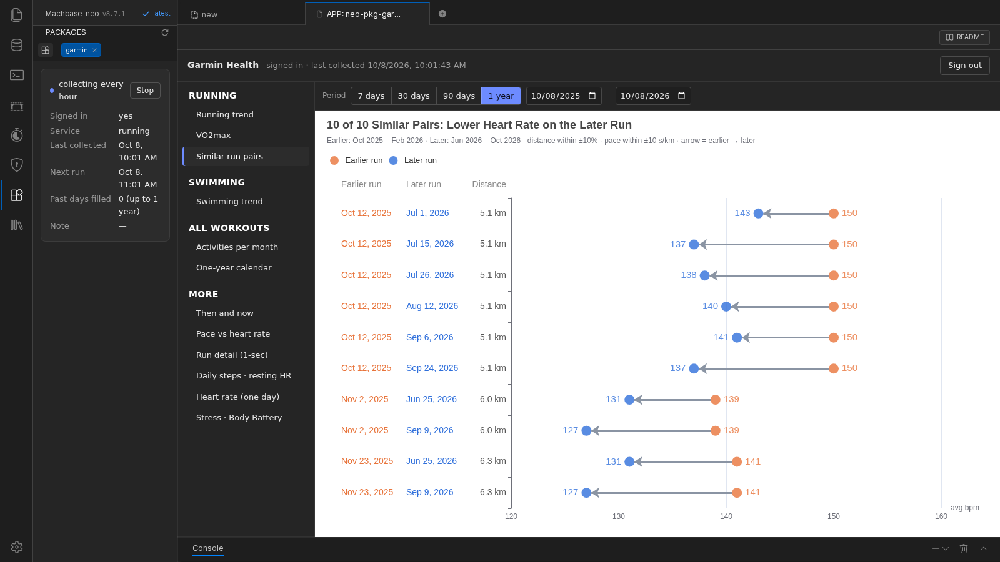

# Garmin Health (neo-pkg-garmin)

[English](README.md) | [한국어](README.ko.md) | [日本語](README.ja.md)

**내 Garmin Connect 데이터(심박, 스트레스, Body Battery, 걸음, 수면, 1초 간격 운동 기록)를 Machbase 에 모아** 대시보드로 보여 주는 machbase-neo 패키지입니다.

- 앱에서 한 번 로그인하면 됩니다. 그 뒤로는 1시간마다 백그라운드에서 수집하고, 로그인 직후에는 최대 1년 전까지 지난 데이터를 채웁니다.
- **TQL 대시보드 12개** — 하루 심박부터 1년 캘린더, 러닝 추세, "같은 페이스에서 낮아진 심박" 비교까지.
- 모두 일반 Machbase 테이블에 저장되므로 SQL·TQL 로 조회하거나 AI 채팅 패키지(`neo-pkg-llm-chat`)로 물어볼 수 있습니다.

> **비공식 패키지입니다.** Garmin 과 제휴·보증·지원 관계가 없습니다. Garmin Connect 모바일 앱과 같은 로그인·데이터 인터페이스를 쓰며, Garmin 은 이를 공개 API 로 제공하지 않습니다. 본인 계정으로만, 본인 책임으로 사용하세요 — [고지](#고지) 참고.



## 요구 사항

- machbase-neo 8.7.1 이상
- 본인의 Garmin Connect 계정(이메일·비밀번호). 2단계 인증 계정도 됩니다 — Garmin 이 보낸 코드를 입력합니다.
- 서버가 HTTPS 로 `sso.garmin.com`, `connectapi.garmin.com`, `thegarth.s3.amazonaws.com` 에 접속할 수 있어야 합니다 (마지막 주소에서 Garmin Connect 모바일 클라이언트가 쓰는 공개 클라이언트 키를 읽습니다).
- machbase-neo 서버의 운영체제가 **Garmin 계정과 같은 시간대**여야 합니다. 날짜는 서버 시간대로 세고, 차트의 시각은 브라우저 시간대로 보입니다.
- 디스크는 적게 듭니다 — 시계 하나에 1년 약 150만 건.

## 설치

1. 이 저장소에서 **Code → Download ZIP** 으로 ZIP 을 받습니다.
2. 받은 파일을 **압축을 풀지 않고** machbase-neo 설치 폴더 아래 `public/` 에 둡니다.

   ```text
   <machbase-neo 설치 폴더>/
   ├── machbase-neo
   └── public/
       └── neo-pkg-garmin-main.zip   ← 여기에 둡니다
   ```

3. machbase-neo 웹 UI 에서 **App Store** 를 열고 목록을 새로고침한 뒤 `neo-pkg-garmin` 의 **Install** 을 누릅니다.
4. 설치가 끝나면 수집 서비스가 바로 시작되어 로그인을 기다립니다. 사이드 패널의 **Start / Stop**(또는 App Store 카드의 스위치)으로 켜고 끕니다.

App Store 는 **machbase-neo 를 실행한 폴더**의 `public/` 에서 아카이브를 찾습니다. `--file` 로 다른 폴더를 지정해 실행했다면 [문제 해결](#문제-해결)을 보세요.

### 업데이트

새 아카이브를 `public/` 에 두고 App Store 에서 **Update** 를 누릅니다. 로그인 상태와 수집한 데이터는 그대로 남습니다.
`public/` 에 패키지 이름과 버전이 같은 아카이브가 둘 있으면 설치가 실패하므로 예전 파일은 지웁니다.

### 삭제

Garmin 토큰도 지우려면 먼저 앱에서 **Sign out** 을 누릅니다. 그다음 App Store 에서 **Uninstall** 을 누르면 수집 서비스가 멈추고 등록이 지워집니다.
**수집한 데이터는 `GARMIN` 데이터베이스에 남습니다.** 필요 없으면 SQL 로 지웁니다.

```sql
DROP TABLE GARMIN.SYS.METRIC CASCADE;
DROP TABLE GARMIN.SYS.SPAN;
DROP TABLE GARMIN.SYS.SYNC_LOG;
DROP DATABASE GARMIN;
```

## 사용법

**App Store** 에서 `neo-pkg-garmin` 을 누르면 패키지 탭이 열립니다. 사이드 패널에 수집 상태가 보입니다.

### 로그인

- Garmin 이메일과 비밀번호를 넣고, Garmin 이 요구하면 받은 인증 코드를 넣습니다 (5분 안에 입력).
- **비밀번호는 저장하지 않습니다.** HTTPS 로 Garmin 의 로그인 서버에만 보냅니다. 남는 것은 Garmin 이 돌려준 토큰뿐이고, 소유자만 읽을 수 있는 권한의 파일에 저장합니다 (Linux·macOS).
- 토큰이 있으면 다시 로그인하지 않아도 수집이 계속됩니다 — 접근 권한은 자동으로 갱신됩니다. 다시 로그인하는 경우는 **Sign out** 을 눌렀을 때, Garmin 비밀번호를 바꿨을 때, Garmin 이 토큰을 무효로 했을 때뿐입니다.
- 계정을 보호하려고 로그인이 3번 실패하면 15분, Garmin 이 로그인을 제한하면(HTTP 429) 2시간 동안 로그인을 받지 않습니다. 로그인을 반복하면 Garmin 이 계정을 제한할 수 있습니다.
- machbase-neo 서버 하나에 Garmin 로그인은 **하나**입니다. 그 서버를 쓰는 사람은 모두 같은 데이터를 봅니다.

### 수집 (자동)

- **1시간마다** : 어제와 오늘. 시계가 늦게 동기화해도 빠지지 않게 어제도 다시 읽고, 이미 저장한 기록은 건너뜁니다.
- **로그인 직후** : 지난 날을 15초에 하루씩, 최대 1년 전까지 채웁니다 (1년치에 약 2시간).
- Garmin 이 요청을 제한하면(HTTP 429) 1시간 쉬었다가 이어 갑니다.
- 새 데이터는 시계가 Garmin Connect(휴대폰 앱)와 동기화한 뒤에 들어옵니다.
- Garmin 이 돌려주는 과거 범위 : 걸음·운동은 1년 이상, 2~3분 간격 심박·스트레스·Body Battery 는 최근 약 5개월.

### Start / Stop

사이드 패널의 **Start / Stop** 버튼으로 수집을 켜고 끕니다 (App Store 카드의 스위치와 같습니다).

- **Stop** 은 수집기를 바로 멈춥니다. Garmin 에 보내는 요청도 멈춥니다. 로그인·수집한 데이터·대시보드는 그대로이고, 받던 날은 다음에 처음부터 다시 받습니다.
- **Start** 는 어제·오늘을 먼저 받고, 멈춘 동안 빠진 날을 채운 뒤 1시간마다 수집합니다.
- Stop 은 **일시 정지**입니다. machbase-neo 를 다시 시작하면 수집기도 다시 켜집니다. 완전히 끄려면 **Sign out**(토큰 삭제)이나 **Uninstall** 을 하세요.

### 대시보드

왼쪽 목록에서 대시보드를 고릅니다 — 종목별로 묶여 있고, 앱을 열면 **Running trend** 가 먼저 보입니다. 위쪽 막대로 기간을 정합니다 — **7 days · 30 days · 90 days · 1 year** 또는 날짜 범위.

| 대시보드 | 보여 주는 것 |
|---|---|
| **Running** | |
| Running trend | 월평균 페이스(움직인 시간 기준)와 심박 |
| VO2max | 러닝마다 Garmin 이 추정한 VO2max |
| Similar run pairs | 거리 ±10% · 페이스 ±10초/km 안인 앞 러닝과 뒤 러닝의 짝. 화살표는 앞 러닝에서 뒤 러닝으로 |
| **Swimming** | |
| Swimming trend | 월평균 100m 페이스와 심박 |
| **All workouts** | |
| Activities per month | 종목별(수영·러닝·그 밖) 월별 운동 수 |
| One-year calendar | 칸 하나가 하루(회색 = 걸음), 점은 운동. 한 열이 한 주이고 위에서 아래로 월~일 |
| **More** | |
| Then and now | 러닝 두 번의 심박을 움직인 시간으로 겹쳐 봅니다. 앞 날짜 이후 첫 러닝과 뒤 날짜 이전 마지막 러닝 |
| Pace vs heart rate | 야외 러닝 하나가 점 하나. "같은 페이스 띠" 에서 앞 기간과 뒤 기간의 평균 심박을 비교 (체크박스로 끔) |
| Run detail (1-sec) | 러닝 한 번의 1초 간격 심박. 고른 날짜 이전의 마지막 러닝, 아래 막대로 확대 |
| Daily steps · resting HR | 하루 걸음(막대)과 안정시 심박(선) |
| Heart rate (one day) | 하루 심박, 10분 평균. 날짜를 고릅니다 |
| Stress · Body Battery | 하루의 스트레스와 Body Battery |

### 사이드 패널

수집 상태(로그인 대기 · 지난 데이터 채우는 중 · 1시간마다 수집 · Garmin 제한으로 쉼 · 멈춤), 로그인 여부, 서비스 상태, 마지막·다음 수집 시각, 마지막 오류를 보여 줍니다. **Start / Stop** 버튼으로 수집을 켜고 끕니다 — 로그인과 데이터는 그대로 남습니다.

## AI 로 물어보기

App Store 에서 **`neo-pkg-llm-chat`** 을 설치하고 다른 탭으로 엽니다. 이 데이터에 SQL 을 대신 실행해 답합니다.

- 테이블을 대문자로(`GARMIN.SYS.METRIC`, `GARMIN.SYS.SPAN`), 태그 이름(`run_vo2max`, `resting_hr` …)과 함께 적고, 값·개수·차트를 요청합니다.
- llm-chat 3.3.1 은 "어떻게", "알려줘", "설명", "차이", "방법" 같은 낱말이 든 질문을 문서 질문으로 보고 **SQL 을 실행하지 않고** 답합니다.
- 중요한 숫자는 대시보드와 대조하세요 — 결론이 맞아도 곁들인 숫자가 틀릴 때가 있습니다.

예 : *GARMIN.SYS.METRIC 의 run_vo2max 로 최근 12개월 VO2max 추세를 차트로 그려 주세요.*

## 저장되는 데이터

| 테이블 | 종류 | 내용 |
|---|---|---|
| `GARMIN.SYS.METRIC` | TAG (분 단위 롤업) | `NAME`, `TIME`, `VALUE` 와 메타데이터 `SOURCE`, `UNIT`, `KIND` |
| `GARMIN.SYS.SPAN` | LOG | 운동과 수면 단계 : `KIND`(`activity`, `sleep`), `LABEL`(`running`, `lap_swimming` …), `BEGIN_TIME`, `END_TIME`, `SECONDS`, `DETAIL`(날짜, 활동 id, 거리 m, 칼로리) |
| `GARMIN.SYS.SYNC_LOG` | LOG | 수집한 날 (`DAY`, `ROWS_LOADED`, `STATUS`, `AT_TIME`) |

`GARMIN.SYS.METRIC` 의 태그 :

| 태그 | 단위 | 간격 |
|---|---|---|
| `hr` · `stress` · `body_battery` | bpm · 점수 · 점수 | 시계를 찬 동안 약 2~3분 |
| `steps` · `resting_hr` · `sleep_minutes` | 걸음 · bpm · 분 | 하루 한 번, 현지 자정 시각 |
| `act_hr` · `act_speed` · `act_cadence` · `act_elevation` · `act_power` · `act_stride` | bpm · m/s · spm · m · W · cm | 운동 중 약 1초 |
| `run_pace` · `run_hr` · `run_vo2max` | 초/km · bpm · ml/kg/min | 러닝마다 하나, 시작 시각 |
| `swim_pace` · `swim_hr` · `swim_swolf` | 초/100 m · bpm · 점수 | 수영(수영장)마다 하나, 시작 시각 |

```sql
-- 월별 안정시 심박
SELECT TO_CHAR(TIME, 'YYYY-MM') AS M, ROUND(AVG(VALUE), 1) AS RESTING_HR
  FROM GARMIN.SYS.METRIC WHERE NAME = 'resting_hr' AND TIME >= NOW - 365d GROUP BY M ORDER BY M;

-- 지난 하루의 시간별 심박 (롤업 — 원본을 읽지 않는다)
SELECT ROLLUP('hour', 1, TIME) AS H, ROUND(AVG(VALUE), 0) AS HR
  FROM GARMIN.SYS.METRIC WHERE NAME = 'hr' AND TIME >= NOW - 1d GROUP BY H ORDER BY H;

-- 최근 90일 러닝마다 페이스(초/km)와 평균 심박
SELECT TIME, MAX(CASE WHEN NAME = 'run_pace' THEN VALUE END) AS PACE_SEC_PER_KM,
       MAX(CASE WHEN NAME = 'run_hr' THEN VALUE END) AS AVG_HR
  FROM GARMIN.SYS.METRIC WHERE NAME IN ('run_pace', 'run_hr') AND TIME >= NOW - 90d GROUP BY TIME ORDER BY TIME;

-- 지난 1년 종목별 운동 수
SELECT LABEL, COUNT(*) AS N FROM GARMIN.SYS.SPAN
  WHERE KIND = 'activity' AND BEGIN_TIME >= NOW - 365d GROUP BY LABEL ORDER BY N DESC;
```

## 설정 파일

모두 `<machbase-neo 설치 폴더>/public/neo-pkg-garmin/cgi-bin/conf.d/` 에 있고 업데이트해도 남습니다. 직접 고칠 필요는 없습니다.

| 파일 | 내용 |
|---|---|
| `token.json` | 로그인하면 생기는 Garmin 토큰. 소유자만 읽는 권한. **비밀번호처럼 다루세요.** Sign out 하면 지워집니다. |
| `signin-guard.json` | 로그인 실패나 Garmin 제한 뒤의 로그인 쉬는 시간 |
| `signin-pending.json` | 인증 코드 대기 (5분 뒤 만료) |
| `neo.json` | 다른 machbase-neo 에 저장할 때만 : `{ "url": "http://<host>:<port>" }`. 없으면 이 서버에 저장합니다. |

수집기는 상태를 `public/neo-pkg-garmin/data/status.json` 에 쓰고, 사이드 패널이 이것을 읽습니다.

## 문제 해결

- **"Garmin is limiting sign-ins for now."** Garmin 이 로그인에 HTTP 429 로 답했습니다. 표시된 시각까지 기다렸다가 한 번만 다시 시도하세요. 이미 있는 토큰으로 하는 수집은 영향이 없습니다. 같은 Garmin 계정으로 수집기 둘(서버 둘)을 동시에 돌리지 마세요.
- **로그인했는데 데이터가 없습니다.** 첫 수집은 1분 안에 시작합니다 — 사이드 패널을 보세요. 데이터는 시계를 찬 시간만 있고, 시계가 Garmin Connect 와 동기화한 뒤에 들어옵니다.
- **App Store 에는 "설치됨" 인데 패키지 탭이 비었거나 404 입니다.** machbase-neo 를 `--file` 폴더가 아닌 곳에서 실행했습니다. `--file` 폴더에서 실행하거나, 실행한 폴더의 `public` 을 `<--file 폴더>/public` 을 가리키는 링크로 바꾼 뒤 다시 설치하세요.
- **날짜가 몇 시간 어긋납니다.** 서버 시간대가 Garmin 시간대와 다릅니다. 내 시간대로 설정된 컴퓨터에서 machbase-neo 를 실행하세요 — machbase-neo 8.7.1 은 다른 `TZ` 환경변수로 실행하면 시작하지 않습니다.

## Garmin 의 요청

이 패키지는 각자 자기 건강 데이터를 자기 데이터베이스에 두려고 만들었습니다. Garmin 이 변경이나 중단을 요청하면 바로 따르겠습니다. 이 저장소의 **Issues** 로 연락해 주세요.

## 고지

Garmin 과 Garmin Connect 는 Garmin Ltd. 또는 그 자회사의 상표입니다. 이 패키지는 독립적인 비공식 도구이며 Garmin 과 제휴·보증·후원·승인 관계가 없습니다.

- **본인 계정, 본인 데이터만.** 자기 Garmin 계정으로 로그인해 자기 데이터를 자기 machbase-neo 서버로 옮기는 도구입니다. 다른 사람의 계정이나 데이터에 쓰지 마세요.
- **비공식 인터페이스.** Garmin 이 공개하지 않은 인터페이스라 언제든 바뀌거나 막힐 수 있고, 그러면 수집이 멈춥니다. **사용이 Garmin 이용약관에 어긋날 수 있고 계정이 제한될 수 있습니다. 위험은 사용자가 집니다.**
- **자격증명이 가는 곳.** 이메일·비밀번호·인증 코드는 HTTPS 로 Garmin 의 로그인 서비스에만 보냅니다 — 이 프로젝트나 machbase 로 보내지 않습니다.
- **요청을 적게 합니다** : 1시간에 한 번, 지난 데이터는 천천히, Garmin 이 HTTP 429 로 답하면 멈춥니다.
- 소프트웨어는 "있는 그대로" 제공되며 어떤 보증도 하지 않습니다.

개발·구조 메모는 [docs/DEVELOPMENT.md](docs/DEVELOPMENT.md) 에 있습니다. 시험은 `test/` 에 있습니다 — 저장소 맨 위에서 `machbase-neo jsh test/test_collector.js` 처럼 하나씩 돌립니다 (OS 상관없음).
